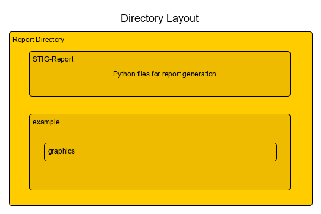

# DISA STIG Report	
This program extracts information from any Code Dx server and returns the findings in a
PDF report.  You specify the project, and it will be examined through the lens of the
most recent Code Dx version of the DISA STIGs.

A PDF format using an Apache FOP template (that is modifiable by the end user).  A number
of XML tags are available for Code Dx and generally look like:

```
<CodeDx content="MyContentTag" />
```

The content tag can be extended in the 'report.py' executable to present custom code that
may be added to the PDF report.

A copy of the XML that is used to generate the PDF is Apache FO format, and uses the Apache
FOP tool.  Please see the requirements to get the correct version.

A configuration file should be modified for your specific situation, and may change to create
additional project PDF files.  The configuration is shown below.

## Requirements
* Python 3
* Python Requests
* Python Matplotlib
* Python Numpy
* Apache FOP (tested with version 2.3.1)
* Java 1.8+

## Configuration
A default configuration file is provided, and *must* be modified before running the system
for the first time.  Here is an example:
```
# Code Dx communications options.
[CodeDx]
transport = http
server = 192.168.101.16
port = 8100
project= WebGoat-6.0.1
api-key = 3e0b8c05-54f6-4eea-8a87-c07f0929c685

# Report specializations appear here
[Report]
graphic_filename = ../example/graphics/DisaStigChart.png
template = template.fo
fo_output = ../example/report.fo
code_detail = 5
```

All of the Code Dx server parameters are defined in the '[CodeDx]' section.  These are:
* transport - should be HTTP or HTTPS (upper or lower case)
* server - IP address or DNS name of the Code Dx server
* port - what port is being used for the Code Dx server
* project - what project should be used to query for data
* api-key - permissions key set up by your administrator

A few report specializations are available to the user without modifying the report template.
These are:
* graphic_filename - a picture to be placed on the cover of the report
* template - the name of the template Apache FO file that will be used to create the PDF
* fo_output - the output of the modified report FO file for review
* code_detail - the number of lines above and below the line that has a finding

Most of the settings can be set up as default, but there are some that must be modified
for your installation.  These are all in the CodeDx section.

## File Layout
Here is the generic layout of the directories.  The only environment requirements are that
the Apache FOP binary (dependent on the operating system you are using) should be in your
path, as well as Java 1.8+.

The anticipated layout is:



All of the Python files and directories in the Git checkout are in one directory, and the
target directory *must* be named ''example'' or the directory specified in your `report.ini`
file under `fo_output` and `graphic_filename`.  All of the graphics inside of the
`graphics_storage` directory in your Git checkout should also be copied to that directory's
`graphics` directory.

## Usage
Extracting gathering the code from the Git repository will create the Python files
directory.  At the same level as the report directory, you should create the
'Example' directory, and a 'graphics' directory inside of it.  Copy the images
from the report directory in 'graphics_storage' over to 'example/graphics'.  These
images will be needed during PDF generation.

The report PDF file is generated in two stages.  This allows the user to 'tweak' the
output file of the data collection (the 'fo' file).  Secondly, the 'fo' file is
processed by 'fop' to create the PDF.  A large number of lines are generated by
Apache's fop.  Just an FYI.

Once the directories are created, cd to the 'report' directory and issue the command:
```sh
python report.py --config report.ini
```

Depending on network speed, this may take a while.  It also depends on the raw number
of findings you have.

The second portion of the operation is to review/modify the 'fo' file, then generate
the PDF.  You will probably want to modify the title page to indicate a real title,
person, and date.  The 'fo' file is XML, and therefore should be easy to look inside
of to modify.  It will be big.  Notepad will not work (but Notepad++ will!).

Change directories to the example directory and execute:
```
fop -fo report.fo -pdf report.pdf
```
Depending on your report size, this may also take a while.  Please be patient.
A PDF file will appear!

## TL;DR

For the more insistent of us:
* Unzip the file, or clone the repository
* create an 'example' directory
* create a 'graphics' directory inside of 'example'
* copy your report directory's 'graphics_storage' contents to 'example/graphics'
* enter the report directory and modify 'report.ini' to point to your Code Dx server

Repeat these steps to generate the PDF.
* enter the 'report' directory and execute 'python report.py --config report.ini'
* move to the 'example' directory and execute 'fop -fo report.fo -pdf report.pdf'
* savor your coffee as this beautiful report is generated!

## Summary
Please contact me if there are any issues: vhopson@codedx.com


